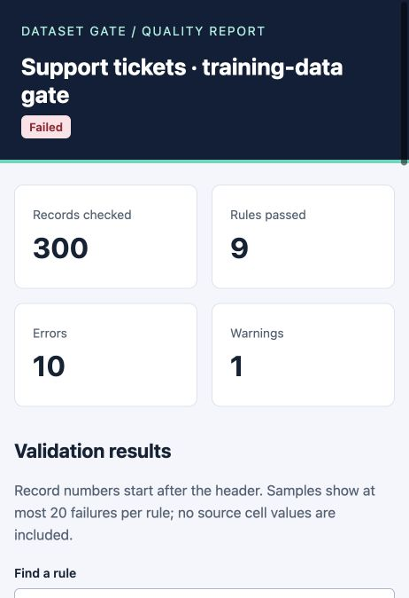

# Dataset Gate

[](https://github.com/pralav-25/dataset-gate/actions/workflows/ci.yml)

**Catch broken CSV data before it reaches an ML pipeline.**

Dataset Gate profiles datasets, enforces versioned data contracts, compares revisions,
and keeps reproducible validation history. Use the CLI in a local pipeline, the optional
FastAPI interface from another application, or an offline HTML report during review.

**Python · FastAPI · SQLite · pytest · GitHub Actions**

## Try the complete workflow

```bash
git clone https://github.com/pralav-25/dataset-gate.git
cd dataset-gate
python -m venv .venv
source .venv/bin/activate
python -m pip install -e '.[api,dev]'

dataset-gate profile examples/tickets.clean.csv
dataset-gate validate examples/tickets.clean.csv --contract examples/tickets.contract.json
# Exit 0: all 20 checks pass.

dataset-gate validate examples/tickets.dirty.csv --contract examples/tickets.contract.json --format html -o reports/dirty.html
# Exit 1 is intentional: 10 checks fail and one raises a warning.
```

Open `reports/dirty.html` to search checks, filter errors, and inspect failing record indices.
The clean and faulty datasets each contain 300 synthetic support-ticket records. No real
customer data is included. The report shows what actually ran, including failures.



## What the application does

- **30 contract checks:** types, ranges, uniqueness, schemas, composite keys, conditional
  requiredness, cross-column comparisons and sums, date ordering, category constraints,
  missingness, functional dependencies, sequences, and text validation.
- **Data profiling and comparison:** blanks, duplicates, lexical types, numeric quantiles,
  schema changes, mean shifts and categorical total variation.
- **Reproducible history:** dataset and contract SHA-256 fingerprints, immutable reports,
  reviewer notes, named passing baselines, saved-run comparisons and protected retention.
- **Useful interfaces:** 14 CLI commands, a versioned local HTTP API with OpenAPI docs,
  batch validation, and JSON/HTML/Markdown/JUnit/CSV exports.
- **Input and output controls:** bounded ingestion, strict contract fields, finite numeric
  domains, optional API bearer tokens, SQL parameter binding, HTML escaping, safe CSV
  exports and atomic file writes that protect source-file aliases.

The validation core uses only Python’s standard library. FastAPI is optional.

## A small contract

```json
{
  "version": 1,
  "name": "Ticket identifiers",
  "rules": [
    {"id": "present", "check": "not_null", "column": "ticket_id"},
    {"id": "unique", "check": "unique", "column": "ticket_id"},
    {"id": "response", "check": "range", "column": "first_response_minutes", "params": {"min": 0, "max": 1440}}
  ]
}
```

`dataset-gate infer data.csv -o draft.json` drafts presence/type rules for review.
It does not infer business truth. `dataset-gate rules` lists every supported check.
[Full rule reference](docs/rules.md) · [Semantics](docs/semantics.md)

## History and API

```bash
dataset-gate validate examples/tickets.clean.csv --contract examples/tickets.contract.json --save --db reports/history.db
dataset-gate history --db reports/history.db
dataset-gate serve --db reports/history.db
```

Open `http://127.0.0.1:8765/docs`. The API accepts CSV text, never server file paths.
Quality failures return a structured report; malformed input produces a client error.
Set `DATASET_GATE_TOKEN` to require a bearer token. Keep network deployments behind an
appropriate authenticated HTTPS proxy. See [security](SECURITY.md) and [deployment](docs/deployment.md).

## Evidence and limits

The tests cover rule boundaries, CLI/API consistency, historical comparisons, transaction
rollback, concurrent SQLite writes, injection-shaped inputs, input aliases and size limits.
CI runs Python 3.11, 3.12 and 3.13. A separate wheel smoke test installs the core without
FastAPI and runs an actual validation command.

A local benchmark processed **10,000 synthetic rows with 20 checks in a median 0.157 seconds**
across three runs, with approximately **9.5 MiB of traced Python allocations** in a separate
memory pass. These measurements include ingestion, validation, fingerprints and profiles;
they exclude source generation and contract loading. They are not deployment guarantees.
[Raw measurement](docs/benchmark-result.json) · [Reproduce it](docs/benchmarks.md)

This is a local, bounded, in-memory application: 5 MB, 50,000 records, 200 columns and
100 contract rules. It does not provide streaming/distributed processing or multi-tenant
accounts. Comparisons are descriptive, not evidence of model degradation. Docker setup
is included; a Docker engine was not available for image execution during development.

## Development and walkthrough

```bash
pytest --cov=dataset_gate
ruff check .
ruff format --check .
python -m build
python scripts/package_smoke.py dist/dataset_gate-0.1.0-py3-none-any.whl
```

[Quickstart](docs/quickstart.md) · [Architecture](docs/architecture.md) ·
[Engineering decisions](docs/decisions.md) · [Project walkthrough](docs/walkthrough.md) ·
[Contributing](CONTRIBUTING.md) · [MIT license](LICENSE)
