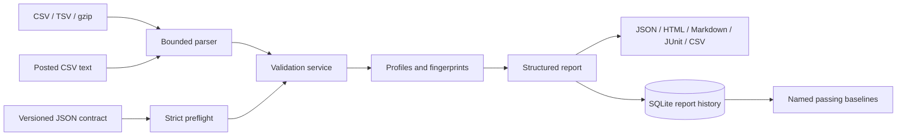

# Architecture

The CLI and optional FastAPI application call the same service. They cannot diverge
on rule semantics. Built-in rules are package modules with parameter schemas and
bounded findings; user configuration cannot load Python code or execute expressions.
The core has no runtime dependencies. FastAPI is an optional adapter.

SQLite stores immutable generated reports, separate review notes, and named baseline
references. Each operation opens and closes its own transaction-scoped connection.
WAL permits readers during writes; foreign keys protect promoted baselines during
retention. Queries bind input values instead of interpolating them.

Content hashes identify parsed data and normalized contracts. New run ids and timestamps
identify each execution, while deterministic result fields support comparisons.

The bounded in-memory design keeps behavior understandable and easy to reproduce.
Larger-than-limit data is rejected, not sampled or silently truncated. This is a local
single-user tool. Multi-tenant authorization, distributed jobs, object storage, and
streaming statistics are future extensions, not implemented capabilities.
